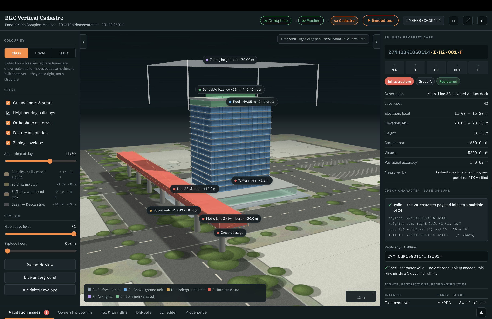
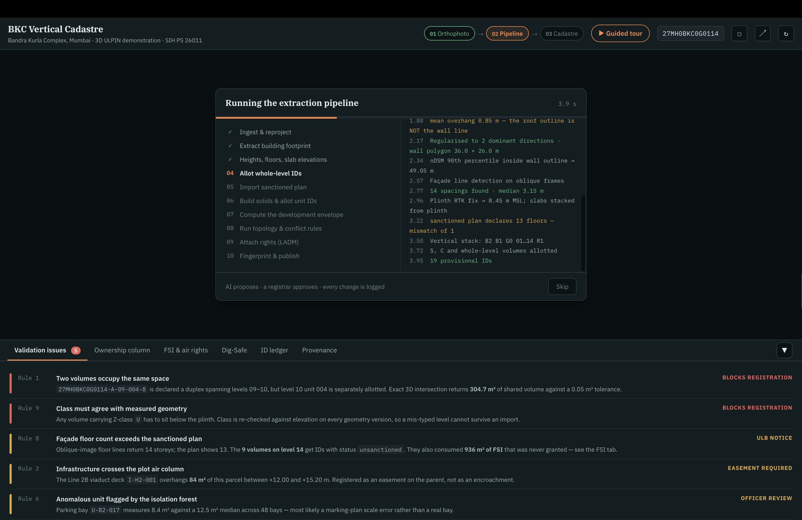
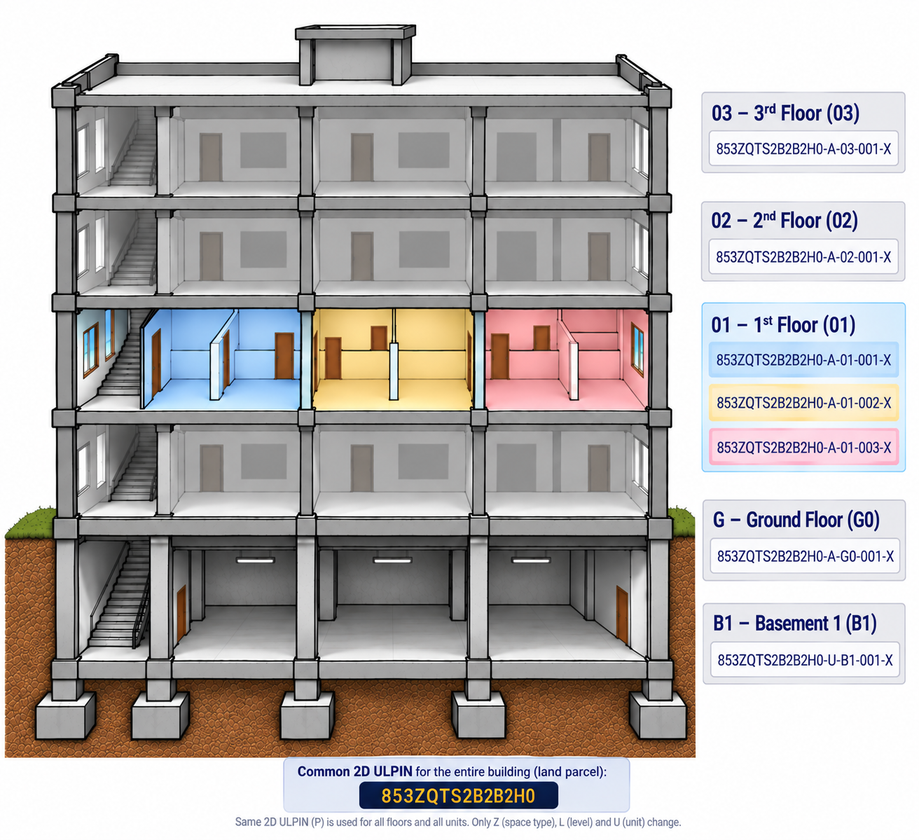
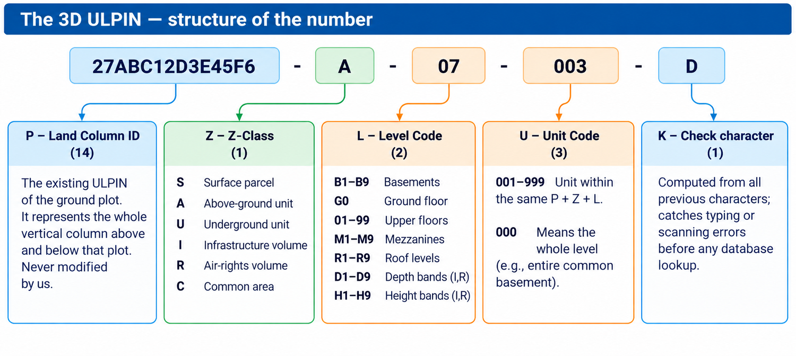
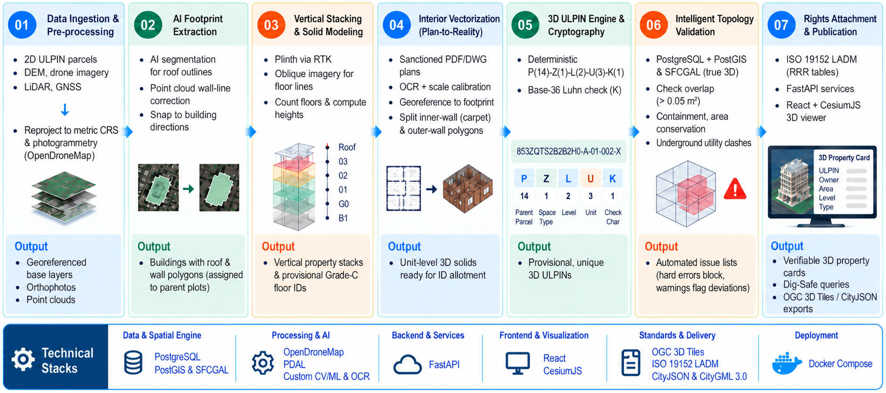
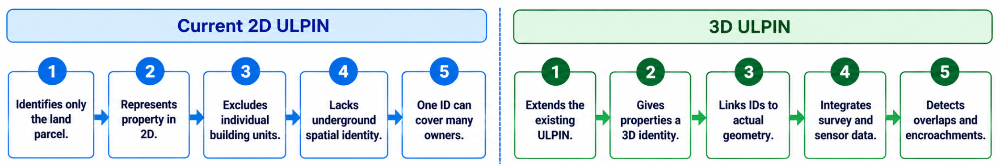

# 🏢 Bhu-Aadhaar 3D: Vertical Cadastre & 3D ULPIN System

[](https://sih.gov.in/)
[](https://sih.gov.in/)
[]()
[]()
[]()

> **Smart India Hackathon 2026 — Problem Statement ID: 26011**  
> **Title:** 3D ULPIN Generation and Vertical Property Mapping System  
> **Team:** Dimension Zero  
> **Pilot Project Area:** Bandra Kurla Complex (BKC), Mumbai • Parcel `27MH0BKC0G0114`

---

## 📌 Executive Summary

India's **Unique Land Parcel Identification Number (ULPIN)**, known as *Bhu-Aadhaar*, provides a groundbreaking 14-digit alphanumeric identity for land parcels. However, traditional 2D ULPIN models treat entire multi-storey towers and vertical developments as a single flat point or 2D polygon on the surface.

This project delivers **Bhu-Aadhaar 3D**, an end-to-end vertical cadastre system that extends the national 14-character ULPIN into **volumetric, unit-level 3D spatial identities**. It enables mathematically precise ownership demarcation, subterranean and air-rights management, automated conflict detection against sanctioned plans, and interactive WebGL-powered 3D visualization.

---

## 📸 System Showcase & Visuals

### 1. 3D Volumetric Cadastre & Stratum Scene
*Interactive 3D spatial modeling showing subterranean strata (reclaimed fill, marine clay, weathered rock), floor-by-floor unit volumes, zoning envelopes, and air rights.*



---

### 2. Automated 10-Step Extraction Pipeline
*End-to-end processing pipeline from drone imagery ingestion to cryptographic fingerprinting and registry publication.*



---

### 3. Volumetric Floor Cadastre Breakdown
*Spatial assignment of 3D ULPIN across multi-level structures (Basements, Ground Floor, Commercial & Residential Floors).*



---

### 4. 3D ULPIN Syntax & Numbering Structure
*Zero-friction backward compatibility: preserving the base 14-character land column ID while appending volumetric stratum and unit identifiers.*



---

### 5. Technical Approach & Architecture
*Data ingestion (SVAMITVA, NAKSHA, LiDAR, Drone Photogrammetry), AI building footprint extraction, 3D solid construction, and LADM rights binding.*



---

### 6. 2D ULPIN Limitations vs. 3D Cadastre
*Why legacy 2D parcel identification falls short in vertical urban environments and how 3D ULPIN solves boundary ambiguity.*



---

## 🏗️ 3D ULPIN Identifier Standard

The 3D ULPIN standard introduces a hierarchical schema compatible with existing DILRMP land registry systems:

```
┌──────────────────────────────┬──────────────┬──────────────┬──────────────┬──────────────┐
│ Base 2D ULPIN (14 chars)    │ Volume Class │ Level / Floor│ Unit Serial  │ Check Digit  │
├──────────────────────────────┼──────────────┼──────────────┼──────────────┼──────────────┤
│       27MH0BKC0G0114         │      A       │      03      │     001      │      X       │
└──────────────────────────────┴──────────────┴──────────────┴──────────────┴──────────────┘
```

- **Base Parcel ID (14 chars):** The root ground parcel identifier under DILRMP / Bhu-Aadhaar.
- **Volume Class (`Z-Class`):**
  - `A` = Above Ground / Superstructure (Floors, penthouses)
  - `G` = Ground Surface Level
  - `U` = Underground / Subterranean (Basements, utility vaults, metro anchors)
  - `S` = Air Rights / Development Potential (Unbuilt sanctioned vertical envelope)
  - `C` = Common Areas (Lobbies, stairwells, fire refuges)
- **Floor Code:** 2-digit elevation code (`B1`, `G0`, `01`, `02`, `03`...).
- **Unit Serial:** 3-digit unit subdivision ID (`001`, `002`...).
- **Verification Hash/Check Digit:** Cryptographic check digit to ensure integrity.

---

## ⚡ Core Features

- **🌐 Pure Client-Side WebGL 3D Cadastre**: High-performance interactive 3D rendering with orbit, pan, slice, and layer isolation without heavy software installations.
- **🏢 Multi-Stratum & Subsurface Modeling**: Visualizes subterranean foundations, geological strata (marine clay, bedrock), underground parking, and infrastructure.
- **📐 Automated Footprint & Slab Extraction**: Computes overhangs, setbacks, floor-to-floor heights, and volumetric envelope boundaries.
- **🛡️ Sanctioned Plan vs. As-Built Verification**: Highlights deviations, illegal floor additions, and envelope breaches with automated compliance scoring (Grades A/B/C/D).
- **📜 LADM (ISO 19152) Integration**: Binds Spatial Units (`LA_SpatialUnit`), Legal Units (`LA_BAUnit`), Right Holders (`LA_Party`), and Rights/Restrictions/Responsibilities (`RRR`).
- **☀️ Environmental & Solar Analysis**: Real-time sun position and shadow casting based on time-of-day for urban density assessment.
- **🌓 Light / Dark Modern UI**: Built with custom typography, responsive design tokens, and smooth micro-animations.

---

## 🚀 Getting Started

### Direct Browser Launch
No complex build steps or node dependencies required. Simply open `index.html` in any modern web browser:

```bash
# Clone the repository
git clone https://github.com/ashyou09/3d_ULPIN.git

# Navigate into the project folder
cd 3d_ULPIN

# Open in your browser (Mac)
open index.html

# Or start a local lightweight web server
python3 -m http.server 8080
# Visit http://localhost:8080 in your browser
```

---

## 🛠️ Technology Stack

| Layer | Technologies |
|---|---|
| **Frontend & 3D Engine** | Vanilla HTML5, CSS3 Variables, WebGL Canvas Rendering |
| **Spatial & Cadastral Standards** | ISO 19152 (LADM), OpenGIS 3D Geometry, DILRMP ULPIN standard |
| **Geospatial & Ingestion** | Drone Photogrammetry (OpenDroneMap), LiDAR point clouds, SVAMITVA, NAKSHA |
| **Backend & Spatial Database** | PostGIS, PostgreSQL 3D Solids (`POLYHEDRALSURFACE`), GeoJSON / CityJSON |
| **Compliance & Verification** | Automated geometry intersection, topological validity checks, rule engines |

---

## 🎯 Impact & Stakeholders

| Stakeholder | Key Value Proposition |
|---|---|
| **Citizens & Buyers** | Verifiable QR-coded 3D property card with exact volume boundaries; eliminates flat-buying ambiguity and duplicate sales. |
| **Financial Institutions** | Anchors mortgages to mathematically unique 3D volumes rather than ambiguous text deeds; prevents multi-bank pledging fraud. |
| **Urban Local Bodies (ULBs)** | Automated detection of unauthorized vertical floor extensions and FSI violations against sanctioned plans. |
| **Utilities & Infrastructure** | Accurate subterranean cadastre avoids accidental drilling into utility lines, metro tunnels, and pipeline corridors. |

---

## 👥 Hackathon Team — Dimension Zero

- **Event:** Smart India Hackathon (SIH) 2026
- **Problem Statement:** 26011 — *3D ULPIN Generation and Vertical Property Mapping System*
- **Theme:** Smart Automation
- **Category:** Software

---

## 📄 License
This project was developed for the **Smart India Hackathon 2026**. All rights reserved by Team **Dimension Zero**.
